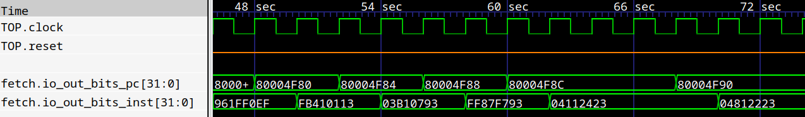
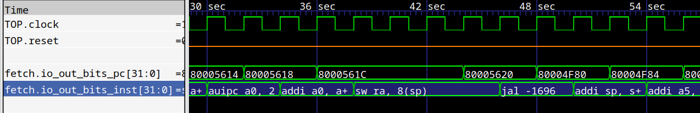

## Gtkwave filter process for RISC

### Before:

### After:

### Support targets:
* RISC-V 32/64 with M/A/F/D
* LoongArch32

### Usage 
1) Highlight the signals you want filtered
2) Edit->Data Format->Translate Filter Process->Enable and Select
3) Click Add Proc Filter to List
4) Open file
5) **Select filter filename from list** $\color{red} {❗IMPORTANT❗} $
6) click OK

> **_NOTE:_**  You can use *File ->Write save file* after applying this filter. This way, it will be applied automatically next time.

### Build dependency
* LLVM >= 16
* Clang++
* Mold (optional)

Pre-built binary can be found in release (built with LLVM-16 on Ubuntu 20.04)

### Notice about Gtkwave freeze

If you experience a freeze in Gtkwave after applying the pre-built
filter binary from release

Please install LLVM-16 or
download `libLLVM-16.so` from release page and place it alongside the filter binary

Please notice that the `libLLVM-16.so` provided on the release page is highly customized for
this project in order to reduce it's size and is not suitable for any other use
